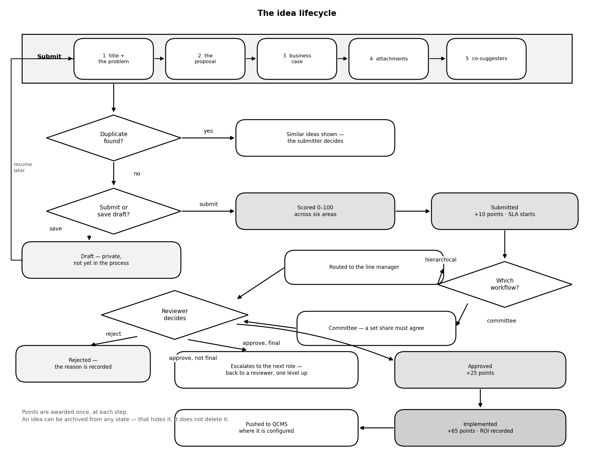
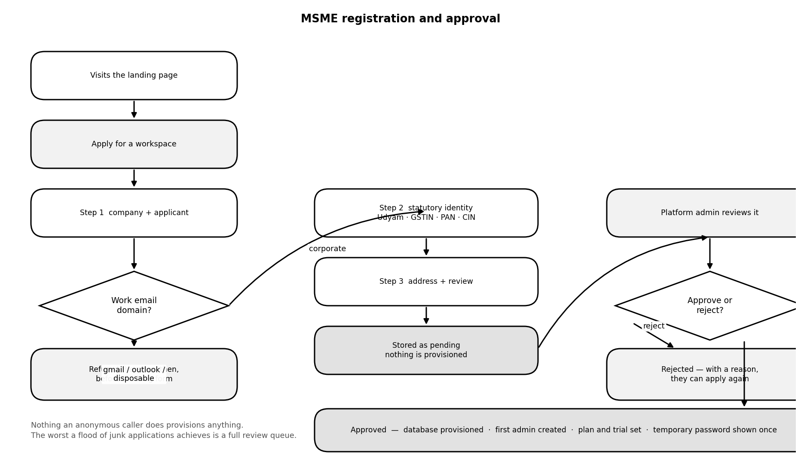
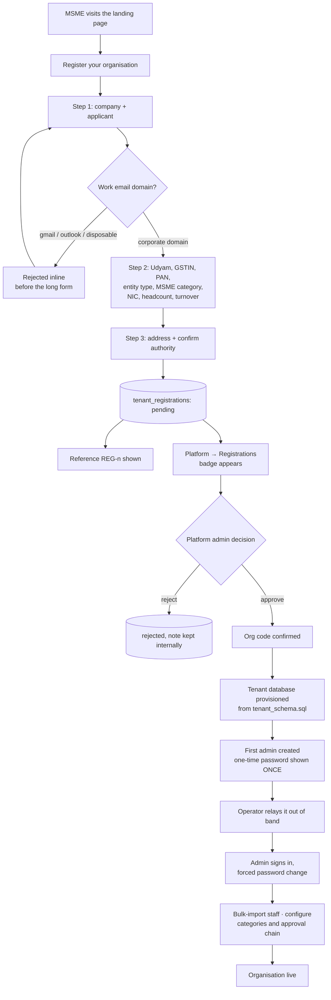
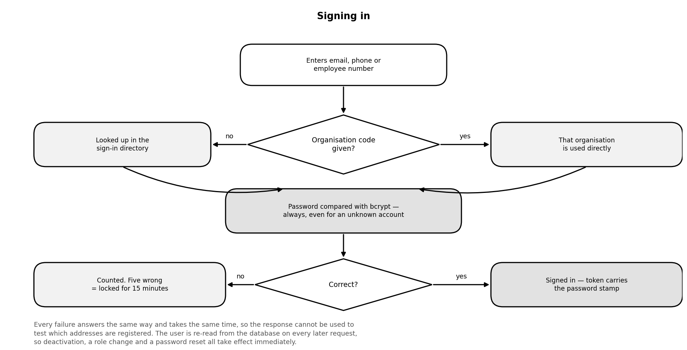
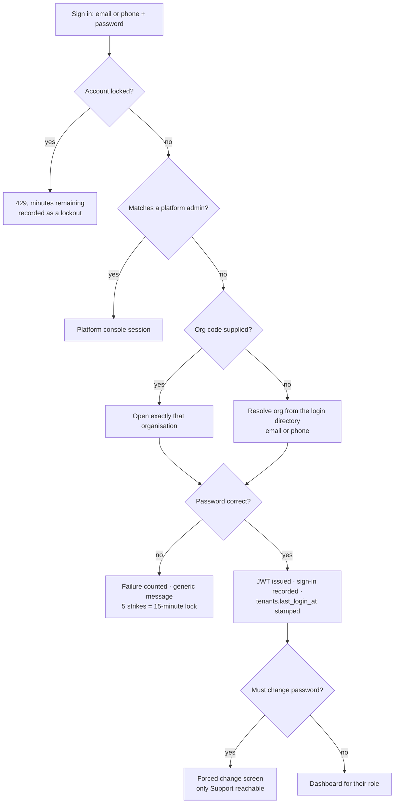
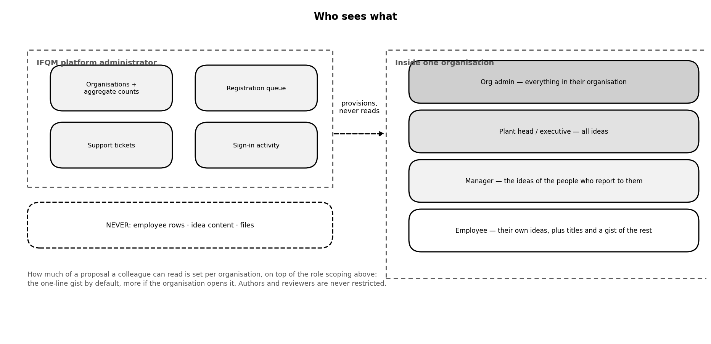
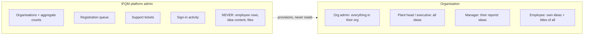

# IFQM EIT — Flows and Timeline

MOM 29 Jul 2026 §2.1.

Each flow is a drawn diagram. The Mermaid source that describes it is kept
underneath in a collapsed block — open it to edit the flow, then rebuild the
images with `python docs/flow_drawings.py`. The picture is what most readers
want; the source is what the next person to change it wants.

---

## 1. Idea lifecycle

The core loop. Everything else in the product exists to keep an idea moving
along this path.



<details>
<summary>Mermaid source for this diagram</summary>

```mermaid
flowchart TD
    A[Employee opens Submit] --> B[Step 1: title + present situation]
    B --> C{Duplicate detected?}
    C -- yes --> C1[Similar ideas shown<br/>submitter decides] --> D
    C -- no --> D[Step 2: proposed solution,<br/>impact areas, tags]
    D --> E[Step 3: business case<br/>feasibility · time required · investment]
    E --> F[Step 4: attachments]
    F --> G[Step 5: co-suggesters]
    G --> H{Submit or save draft?}
    H -- draft --> H1[(Status: Draft)]
    H1 --> B
    H -- submit --> I[AI / heuristic scores 0-100<br/>across six dimensions]
    I --> J[(Status: Submitted)<br/>+10 points · SLA clock starts]
    J --> K{Workflow type}
    K -- hierarchical --> L[Routed to line manager]
    K -- multi-reviewer --> M[Committee assigned<br/>approval threshold applies]
    L --> N{Reviewer decision}
    M --> N
    N -- reject --> O[(Status: Rejected)<br/>reason recorded in timeline]
    N -- approve, not final --> P[Escalates to next role in chain]
    P --> N
    N -- approve, final role --> Q[(Status: Approved)<br/>+25 points]
    Q --> R[Implementation owner + target date]
    R --> S[(Status: Implemented)<br/>+65 points · ROI captured]
    S --> T{QCMS configured?}
    T -- yes --> U[Pushed to QCMS<br/>counted in the platform console]
    T -- no --> V[Ends here]
    O --> W[Visible in Rejected Ideas<br/>with its reason]
```

</details>

**SLA and escalation.** `review_sla_days` flags an idea as overdue; nothing is
reassigned. `escalation_days` moves it up the chain. Both are per organisation,
and the distinction is the reason those fields carry info buttons (§12.13).

---

## 2. MSME registration and approval

Nothing an anonymous caller does provisions anything. The worst a flood of junk
applications achieves is a full review queue.



<details>
<summary>Mermaid source for this diagram</summary>



</details>

A duplicate application returns the same response as a new one. Telling an
anonymous caller "this company already has an account" is a free customer-list
lookup.

---

## 3. Authentication



<details>
<summary>Mermaid source for this diagram</summary>



</details>

Every subsequent request re-reads the user from the database, so deactivation,
role change and password reset take effect immediately rather than at token
expiry.

---

## 4. Who sees what



<details>
<summary>Mermaid source for this diagram</summary>



</details>

The full proposal text follows the org's `solution_visibility` setting, on top
of the role scoping above.

---

## 5. Timeline

| When | Milestone |
|---|---|
| Early 2026 | PHP prototype: capture and basic review |
| — | Multi-tenancy: registry + schema per organisation |
| — | Rewrite to React + Node/Express; JWT replaces sessions |
| — | Configurable approval chains, SLA/escalation, committees |
| — | Points, leaderboard, challenges, community voting |
| — | Implementation tracking, ROI, analytics, audit log |
| — | Security hardening: lockout, per-request re-auth, console privacy contract |
| — | 7-language i18n, bulk import, email/phone login |
| — | QCMS integration |
| **29 Jul 2026** | **Review meeting — this MOM** |
| Aug 2026 | MSME self-registration, solution privacy, podium leaderboard, on-hold vs inactive, quotas, patentability, archiving |
| Aug 2026 | Free-tier deployment live (Vercel + Render + Aiven) |
| Next | SMTP in production · OTP login · UAT · Azure OAuth + SSO · billing |

Dates before the MOM are deliberately unanchored: the repository history has the
commit dates, and inventing precise milestones for a handover document would be
worse than saying so.
