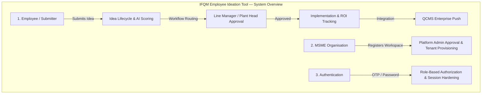
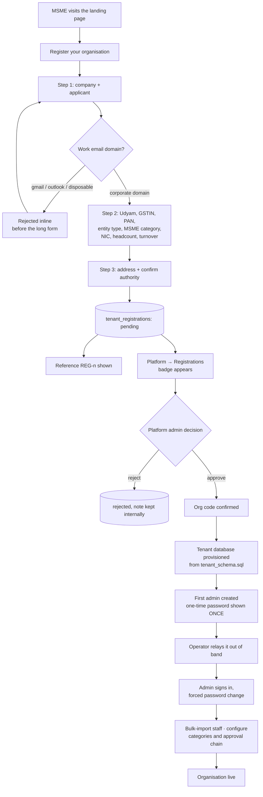
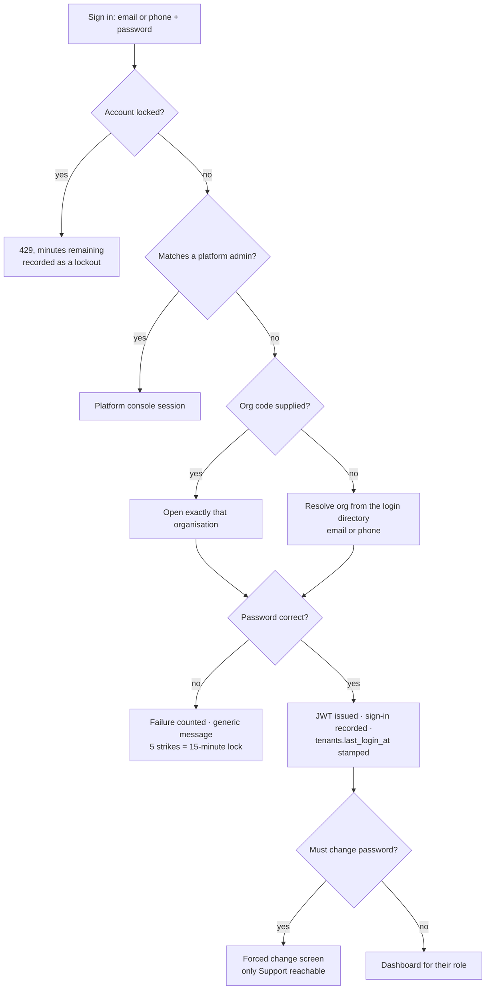
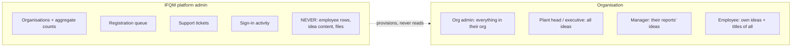
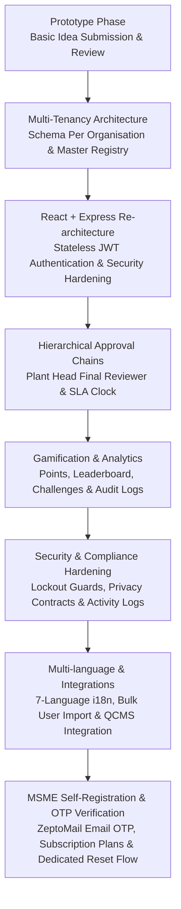

# IFQM Employee Ideation Tool — Flows and Timeline

**How an idea travels, how an organisation joins, who can see what, and when each part was built.**

<table>
<tr>
<td><b>Audience</b></td>
<td>Anyone who needs to understand how the product behaves without reading the code — a new engineer, a reviewer of the design, or IFQM staff answering a customer.</td>
</tr>
<tr>
<td><b>How to read it</b></td>
<td>Each flow is visually illustrated below with diagrams and structured execution paths.</td>
</tr>
<tr>
<td><b>Source</b></td>
<td>MOM 29 July 2026, §2.1. System Workflow and Process Specifications.</td>
</tr>
</table>

---

## System Overview Diagram




### Contents

| | Flow | What it answers |
|---|---|---|
| **1** | [Idea lifecycle](#1-idea-lifecycle) | What happens between somebody noticing a problem and the saving being recorded |
| **2** | [MSME registration and approval](#2-msme-registration-and-approval) | How an organisation gets a workspace, and what stops anybody helping themselves to one |
| **3** | [Authentication](#3-authentication) | How somebody signs in, and what happens when they get it wrong |
| **4** | [Who sees what](#4-who-sees-what) | Which parts of an idea reach which people |
| **5** | [Timeline](#5-timeline) | When each part of the product was built |

---

## 1. Idea lifecycle

The core loop. Everything else in the product exists to keep an idea moving along this path.


```mermaid
flowchart TD
    A[Employee opens Submit] --> B[Step 1: title + present situation]
    B --> C{Duplicate detected?}
    C -- yes --> C1[Similar ideas shown<br/>submitter decides] --> D
    C -- no --> D[Step 2: proposed solution,<br/>impact areas, tags]
    D --> E[Step 3: business case<br/>feasibility · time required · investment]
    E --> F[Step 4: attachments]
    F --> G[Step 5: co-suggesters]
    G --> H{Submit or save draft?}
    H -- draft --> H1[(Status: Draft)]
    H1 --> B
    H -- submit --> I[AI / heuristic scores 0-100<br/>across six dimensions]
    I --> J[(Status: Submitted)<br/>+10 points · SLA clock starts]
    J --> K{Workflow type}
    K -- hierarchical --> L[Routed to line manager]
    K -- multi-reviewer --> M[Committee assigned<br/>approval threshold applies]
    L --> N{Reviewer decision}
    M --> N
    N -- reject --> O[(Status: Rejected)<br/>reason recorded in timeline]
    N -- approve, not final --> P[Escalates to next role in chain]
    P --> N
    N -- approve, final role --> Q[(Status: Approved)<br/>+25 points]
    Q --> R[Implementation owner + target date]
    R --> S[(Status: Implemented)<br/>+65 points · ROI captured]
    S --> T{QCMS configured?}
    T -- yes --> U[Pushed to QCMS<br/>counted in the platform console]
    T -- no --> V[Ends here]
    O --> W[Visible in Rejected Ideas<br/>with its reason]
```

| | |
|---|---|
| **Starts when** | An employee opens Submit |
| **Ends in** | Implemented and measured, rejected with a reason, or archived |
| **Points** | +10 submitted · +25 approved · +65 implemented, each awarded once |
| **Who decides** | The line manager, or a committee where the organisation routes it that way |
| **Settings that bite** | `review_sla_days`, `escalation_days`, `approval_threshold` |

> [!IMPORTANT]
> **An overdue idea and an escalated idea are different things.**
> `review_sla_days` marks an idea as late so somebody chases it — nothing moves
> and nobody is reassigned. `escalation_days` is what actually moves it up the
> chain. Both are per organisation, and confusing the two is why those fields
> carry information buttons in the admin panel.

> [!NOTE]
> A draft is private to its author, has not entered the process, and can be
> resumed at any time. Nothing happens to it until it is submitted.

---

## 2. MSME registration and approval




| | |
|---|---|
| **Starts when** | A business fills in the form on the landing page |
| **Ends in** | A provisioned workspace with a first administrator, or a rejection with a reason |
| **Decided by** | IFQM platform staff, who also set the plan and the trial length |
| **Checked** | Corporate email domain, then Udyam, GSTIN, PAN, CIN, NIC and PIN formats |

> [!WARNING]
> **Nothing an anonymous caller does provisions anything.**
> The worst a flood of junk applications achieves is a full review queue. No
> database is created, no account exists, and no email is sent to anybody but
> the applicant until a human approves it.

> [!TIP]
> A duplicate application returns exactly the same response as a new one.
> Telling an anonymous caller "this company already has an account" would be a
> free customer-list lookup for anybody who wanted one.

---

## 3. Authentication




| | |
|---|---|
| **Sign in with** | Email, registered phone number, or employee number |
| **Organisation code** | Optional — the sign-in directory resolves it when it is left out |
| **Wrong passwords** | Five, then a 15-minute lock. The right password does not open it early |
| **Session** | A signed token that carries the account's password-change stamp |

> [!IMPORTANT]
> **The token is a claim, not a source of truth.**
> Every request re-reads the user from the database, so deactivating somebody,
> changing their role, or resetting their password takes effect on their very
> next request rather than whenever the token happens to expire.

> [!NOTE]
> Every failure — unknown account, wrong password, deactivated account — answers
> the same way and takes the same time. A response that differs is a way to test
> which addresses are registered.

---

## 4. Who sees what




| Who | Sees |
|---|---|
| **Employee** | Their own ideas in full. For everybody else's: the title, the status, and whatever their organisation has opened up |
| **Manager** | The ideas of the people who report to them |
| **Plant head / executive** | Every idea in the organisation |
| **Organisation admin** | Everything in their organisation, plus the settings that govern it |
| **IFQM platform staff** | Which organisations exist, how many people and ideas each has, the registration queue, support tickets and sign-in activity |

> [!CAUTION]
> **IFQM staff never see the content of an idea, an employee record, or a file.**
> The platform console provisions organisations and counts them. It does not read
> them, and there is no screen anywhere in it that could.

> [!NOTE]
> On top of the role scoping above, each organisation chooses how much of a
> proposal a colleague outside an idea may read — the one-line gist by default.
> Authors and reviewers are never restricted by that setting.

---

## 5. Timeline




| When | Milestone |
|---|---|
| Early 2026 | PHP prototype: capture and basic review |
| — | Multi-tenancy: registry + schema per organisation |
| — | Rewrite to React + Node/Express; JWT replaces sessions |
| — | Configurable approval chains, SLA/escalation, committees |
| — | Points, leaderboard, challenges, community voting |
| — | Implementation tracking, ROI, analytics, audit log |
| — | Security hardening: lockout, per-request re-auth, console privacy contract |
| — | 7-language i18n, bulk import, email/phone login |
| — | QCMS integration |
| **29 Jul 2026** | **Review meeting — this MOM** |
| Aug 2026 | MSME self-registration, solution privacy, podium leaderboard, on-hold vs inactive, quotas, patentability, archiving |
| Aug 2026 | Free-tier deployment live (Vercel + Render + Aiven) |
| Aug 2026 | Subscription plans, trials and billing; organisation profile dashboard |
| Next | SMTP in production · OTP login · UAT · Azure OAuth + SSO |

> [!NOTE]
> Dates before the review meeting are deliberately unanchored. The repository
> history carries the commit dates, and inventing precise milestones for a
> handover document would be worse than saying so.

---

<sub>Colour coding is consistent across every diagram in this project — indigo for the path through the system, teal for stored data, amber for a decision, green for an outcome somebody wanted, red for a refusal, slate for anything outside our control.</sub>
